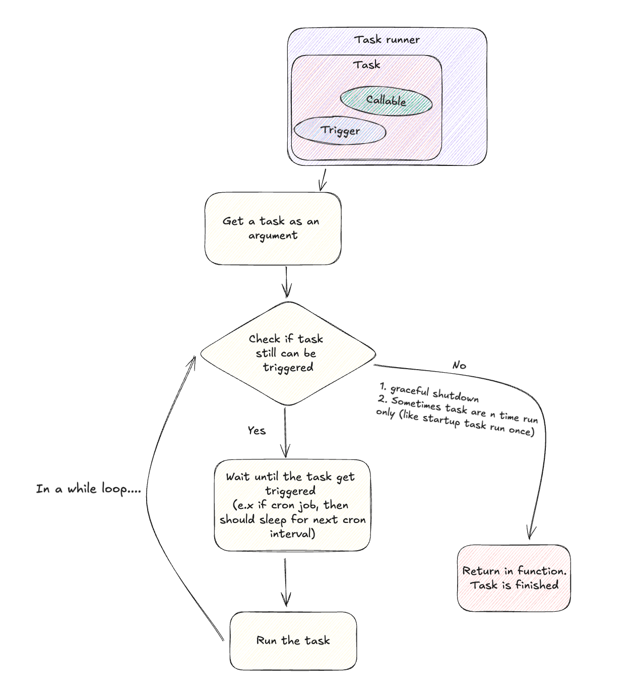

# AioClock: Overview

## Introduction

AioClock is a lightweight, asynchronous task scheduling framework designed for Python applications. It provides a structured approach to managing, scheduling, and executing tasks with integrated dependency injection, making it highly modular and testable.

## Key Components

### 1. AioClock Application

The central orchestrator for all tasks. It initializes, manages, and executes tasks based on their defined triggers.

### 2. Dependency Injection System

A built-in system for injecting dependencies into tasks, enabling loose coupling and improving testability. It uses [FastDepends](https://lancetnik.github.io/FastDepends/) internally, which is very fimiliar with [FastAPI Dependency Injection System](https://fastapi.tiangolo.com/tutorial/dependencies/)

### 3. Task

A unit of work that can be scheduled and executed asynchronously. Tasks are defined using specific triggers that determine their execution conditions.

### 4. Trigger

Conditions or events that initiate task execution. It includes

- **Every**: Repeats a task at regular intervals.
- **At**: Executes a task at a specified time.
- **Once**: Runs a task a single time.
- **OnStartUp**: Runs when the application starts.
- **OnShutDown**: Executes during application shutdown.
- **Forever**: Continuously runs a task in an infinite loop.
- **Cron**: Uses cron syntax for scheduling.
- **OrTrigger**: Initiate with a list of triggers, and executes when at least one of the included triggers activate.

### 5. Group

A logical collection of tasks. Groups allow related tasks to be bundled and managed together, simplifying task organization and execution. Group allow you to code with aioclock in modular way.

### 6. Task Runner

The engine that monitors and executes tasks according to their triggers, ensuring tasks run in the correct order and at the right time.

### 7. Serve

The entry point that starts the AioClock application. It initiates the task runner, which monitors and executes tasks based on their triggers.

### 8. Callable

A function or method associated with a task, executed when the task's trigger condition is met.

## Diagrams

### Ownership

In AioClock, tasks are managed through clear ownership within groups, using dependency injection. Groups encapsulate related tasks, each with specific triggers and callables. The include_group() function integrates these groups into the AioClock application, while standalone tasks are managed with decorators like @aioclock.task. This structure ensures that tasks are organized, maintainable, and easy to scale, with each component having a defined responsibility within the application.
The dependency injection system in AioClock allows you to override a callable with another through the application interface, facilitating testing. For example, instead of returning a session from a PostgreSQL database with get_session, you can override it to use get_sqlite_session, which provides a SQLite session instead. This flexibility makes it easier to swap out components for testing or other purposes without changing the core logic.

### Aioclock LifeCycle

This diagram shows the lifecycle of an AioClock application. It starts with the app.serve() call, which gathers all tasks and groups. The application then checks for startup tasks, runs them, and proceeds to other tasks. If a shutdown task is detected, it's executed before the application gracefully exits. If no shutdown tasks are present, the application simply exits. The diagram ensures a clear, step-by-step process for task management within the AioClock framework, ensuring tasks are executed in the proper order.

### Task Runner Execution Flow

This diagram breaks down how a task is handled in the AioClock system. The task runner first receives the task, checks if it’s still valid to run, and then either waits for the appropriate trigger (like a scheduled time) or finishes if it’s no longer needed. If valid, the task is executed; otherwise, the system gracefully exits. This loop continues until all tasks are either completed or stopped, ensuring everything runs smoothly and on time.
